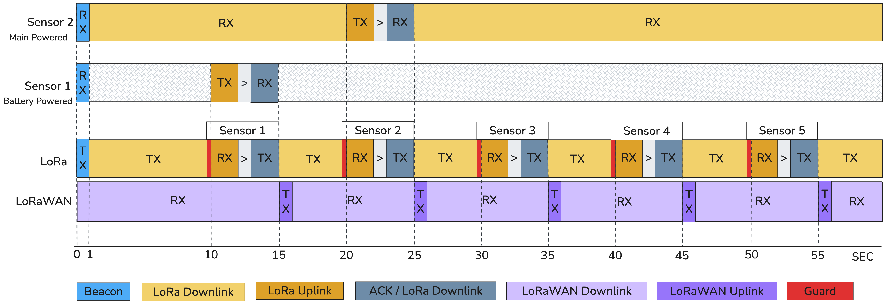

# 🏠 Smart Home IoT System — Firmware

> Firmware for the LoRa Based Smart Home System developed by GROUP 1 of the 34346 Networking technologies and application development for Internet of Things (IoT) course Spring 2026.
>
> The system comprises a mains-powered gateway and three end nodes: a smart thermostat, a smart light, and a smart lock, communicating over a custom LoRa TDMA protocol. The gateway bridges local LoRa traffic to a LoRaWAN network connected to a ChirpStack server hosted on Azure.


## Repository Structure

```
FIRMWARE/
├── docs/
│   ├── Current_Profiles/       # STM32 power measurement captures (.csv / .png)
│   ├── PCB_DESIGN/             # KiCad schematic and layout files for the custom light node PCB
│   └── TDMA.png                # Custom TDMA protocol frame diagram
│
├── src/
│   ├── Gateway.cpp             # Gateway firmware — TDMA scheduler, LoRaWAN bridge, FreeRTOS tasks
│   │
│   ├── Door_Lock/
│   │   ├── Door_Lock.cpp       # TDMA protocol loop, beacon detection, continuous RX mode
│   │   ├── Door_Lock.h         # Hardware init, authentication FSM, payload building, AES-GCM crypto
│   │   └── README.md
│   │
│   ├── Smart_Light/
│   │   ├── Smart_Light.cpp     # TDMA loop, beacon detection, deep sleep scheduling, PIR wake handling
│   │   ├── Smart_Light.h       # Hardware init, PIR ISR, motion state, battery reading, payload building
│   │   └── README.md
│   │
│   └── Thermostat/
│       ├── Thermostat.cpp      # TDMA protocol loop, beacon detection, deep sleep scheduling
│       ├── thermostat.h        # Hardware init, sensor reading, payload building, downlink handling
│       └── README.md
│
├── platformio.ini              # PlatformIO build configuration — select node type via build flags
├── .gitignore
└── README.md                   # This file
```
## Custom Communication Protocol
 
The system uses a **two-tier communication model**:
 
**Tier 1 — Local LoRa TDMA:** All three end nodes communicate with the gateway over a custom Time Division Multiple Access protocol on raw LoRa at 868.1 MHz. A 60-second frame is divided into dedicated uplink slots, one per node, guaranteeing collision-free, deterministic channel access without any carrier-sense overhead.
 
**Tier 2 — LoRaWAN:** The gateway's second radio module forwards node telemetry to a ChirpStack network server on Azure via a local Raspberry Pi LoRaWAN gateway (RAK PG1302). Downlinks from the cloud (new thermostat setpoints, remote unlock commands) arrive on the same Class C LoRaWAN link and are routed by the gateway to the appropriate node.
 
```
[Thermostat] ──┐
[Smart Light] ──┤── LoRa TDMA ──► [ESP32 Gateway] ──► LoRaWAN ──► [RPi / RAK PG1302] ──► ChirpStack (Azure)
[Smart Lock]  ──┘                        │◄────────────────────────────────────────────────── Downlinks
                                         │
                                   (FreeRTOS tasks)
                                   TDMA_TaskManager    (core 1, priority 2)
                                   Downlink_TaskManager (core 1, priority 1)
                                   LoraWAN_TaskManager  (core 0, priority 1)
```
 
The gateway broadcasts a 1-second beacon at the start of every 60-second frame. Each node is assigned a dedicated 10-second slot consisting of a 2-second TX window and a 2-second ACK window, with 500 ms guard times managed by the gateway on either side. Up to 5 nodes can be accommodated within a single frame.
 


## Devices

### Gateway (`src/Gateway.cpp`)

Mains-powered ESP32-WROOM-32E with two RN2483A radio modules on separate UART peripherals. Runs three FreeRTOS tasks:

| Task | Core | Priority | Responsibility |
|---|---|---|---|
| `TDMA_TaskManager` | 1 | 2 | Broadcasts beacon every 60 s, opens per-slot RX windows, sends ACKs (with piggybacked downlinks for thermostat), forwards payloads to LoRaWAN task |
| `Downlink_TaskManager` | 1 | 1 | Blocks on task notification; broadcasts asynchronous downlink commands (e.g. remote unlock) during idle inter-slot periods |
| `LoraWAN_TaskManager` | 0 | 1 | Forwards uplink payloads via LoRaWAN; receives and routes Class C downlinks from the cloud |

The uplink payload buffer shared between the TDMA and LoRaWAN tasks is protected by a FreeRTOS mutex. The TDMA task signals the LoRaWAN task via `xTaskNotifyGive()` on each successful slot reception; the LoRaWAN task checks for this notification non-blockingly so an arriving Class C downlink is never missed.

---

### 🌡️ Smart Thermostat (`src/Thermostat/`)

Battery-powered. Measures temperature and humidity (DHT11), displays readings and setpoint on a 16×2 I²C LCD, and supports local setpoint adjustment via a rotary encoder. Accepts remote setpoint commands piggybacked onto the gateway ACK frame.

Deep-sleep driven: wakes 2.5 s before the expected beacon, listens for up to 5 s, stays awake to build and transmit the payload at its assigned slot, then sleeps until the next beacon. A second EXT0 wakeup on the encoder button (GPIO32) allows local UI interaction at any time.

→ See [`src/Thermostat/README.md`](src/Thermostat/README.md) for full payload format, downlink spec, and build flags.

---

### 💡 Smart Light (`src/Smart_Light/`)

Battery-powered. Monitors motion via an HC-SR501 PIR sensor and drives an LED indicator. Reports motion state, motion count, and battery level each TDMA cycle.

Deep-sleep driven across **two timer wakes per frame**: the first wake listens for the beacon then sleeps until the TDMA slot; the second wake transmits, receives an ACK, and sleeps until the next beacon. A parallel EXT0 wakeup on the PIR pin (GPIO27) allows the LED to track motion in near real-time without staying fully awake between beacons. PIR ext0 is only armed after the first full sleep cycle to avoid spurious wakes during the HC-SR501's 60-second warm-up.

→ See [`src/Smart_Light/README.md`](src/Smart_Light/README.md) for full payload format, power management details, and build flags.

---

### 🔒 Smart Lock (`src/Door_Lock/`)

Mains-powered. Implements two-factor access control (RFID card + PIN keypad). Unlike the battery-powered nodes, it runs continuously and keeps its radio in receive mode at all times, ready to act on encrypted remote unlock commands at any point in the frame.

Downlink commands use AES-GCM (128-bit) with a pre-shared key stored in NVS and that is never transmitted. The node verifies the GCM authentication tag and a monotonically increasing sequence number before actuating, preventing both tampering and replay attacks.

→ See [`src/Door_Lock/README.md`](src/Door_Lock/README.md) for the authentication FSM, downlink crypto format, and build flags.


## LoRa Physical Layer

All nodes and the gateway TDMA radio share the same physical-layer configuration:

| Parameter | Value |
|---|---|
| Frequency | 868.1 MHz |
| Spreading Factor | SF7 |
| Bandwidth | 125 kHz |
| Coding Rate | 4/5 |
| TX Power | 14 dBm |
| Sync Word | 0x12 |
| CRC | On |
| Preamble | 8 symbols |


## Payload Frame Format

All uplink payloads follow a common structure:

| Byte | Field | Description |
|---|---|---|
| 0 | `NODE_ID` | Unique device identifier. MSBs [7:5] encode device type: `001` = thermostat, `010` = light, `011` = lock |
| 1 | Command | `0x00` = uplink (sensor data), `0x01` = downlink (command) |
| 2–7 | Device payload | Device-specific data, zero-padded to 8 bytes total |

The gateway validates each received packet against the `NODE_ID` expected for the active TDMA slot, silently discarding anything that doesn't match.


## Build & Flash

Each node is a separate PlatformIO build environment, selected via build flags in `platformio.ini`. Set the following for each node:

```ini
; Thermostat
build_flags = -D NODE_THERMOSTAT -D NODE_ID=0x20 -D TRANS_SLOT_MS=10000

; Smart Light
build_flags = -D NODE_LIGHT -D NODE_ID=0x60 -D TRANS_SLOT_MS=20000

; Smart Lock
build_flags = -D NODE_LOCK -D NODE_ID=0x40 -D TRANS_SLOT_MS=30000
```

`TRANS_SLOT_MS` is the node's offset from the beacon in milliseconds (e.g. `10000` = slot 1, `20000` = slot 2, `30000` = slot 3). The gateway has no build flags — flash `src/Gateway.cpp` directly.