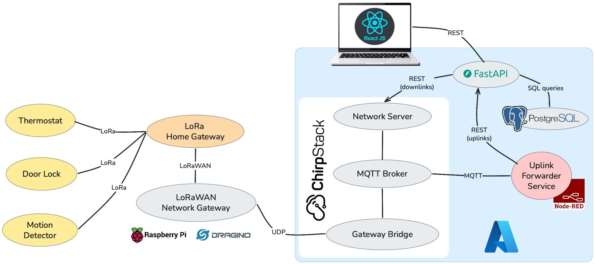

# 🏠 LoRa-Based Smart Home IoT System

> **Group 1** — 34346 Networking Technologies and Application Development for Internet of Things (IoT), Spring 2026, Technical University of Denmark (DTU).

A complete end-to-end smart home system spanning embedded firmware, a custom wireless protocol, and a self-hosted cloud stack. Three ESP32 sensor nodes communicate with a central gateway over a custom LoRa TDMA protocol. The gateway bridges local traffic via LoraWAn to a network gateway connected to a ChirpStack server on Azure, where a FastAPI backend and React dashboard provide real-time monitoring and remote control.

## Authors

| Name | Student ID |
|---|---|
| Afonso Martim Domingues | s252985 |
| Filippo Pruzzi | s250237 |
| Gabriel Crawford | s250167 |
| Georgios Konstantinos Zacharopoulos | s253166 |
| Nikitas Tsinnas | s253629 |
| Stavros Togkousidis | s253624 |


## System Architecture



The system is organised into two tiers:

**Tier 1 — Local LoRa TDMA:** A custom Time Division Multiple Access protocol governs all communication between the three end nodes and the gateway on a shared 868.1 MHz LoRa channel. A 60-second frame is divided into dedicated slots, one per node, guaranteeing collision-free, deterministic channel access without any carrier-sense overhead.

**Tier 2 — LoRaWAN:** The gateway's second radio forwards node telemetry via a local Raspberry Pi packet forwarder (RAK PG1302), acting as a LoraWAN local Gateway, to a ChirpStack network server hosted on Azure. Cloud-initiated commands (thermostat setpoints, remote unlock) are delivered back to the gateway over the same Class C LoRaWAN link.


## Nodes

| Device | Power | Function |
|---|---|---|
| 🌡️ Smart Thermostat | Battery | Measures temperature and humidity; local setpoint adjustment via rotary encoder and LCD; accepts remote setpoint downlinks |
| 💡 Smart Light | Battery + custom PCB | PIR-triggered LED; reports motion events and battery level; deep sleep with dual wake source (timer + PIR ext0) |
| 🔒 Smart Lock | Mains | Two-factor access control (RFID + PIN); accepts AES-GCM encrypted remote unlock commands; continuous LoRa RX |
| 📡 Gateway | Mains | Dual-radio ESP32 bridge; runs TDMA scheduler, LoRaWAN uplink/downlink, and FreeRTOS task architecture |


## Repository Structure

```
/
├── Firmware/               # All ESP32 firmware (gateway + 3 nodes)
│   ├── src/
│   │   ├── Gateway.cpp
│   │   ├── Door_Lock/
│   │   ├── Smart_Light/
│   │   └── Thermostat/
│   ├── docs/
│   └── README.md           # Firmware-level README
│
├── Cloud/                  # Backend, frontend, and infrastructure
│   ├── app/                # FastAPI backend
│   ├── frontend/           # React + TypeScript dashboard
│   ├── docker-compose.yml
│   └── README.md           # Cloud-level README
│
└── README.md               # This file
```

→ See [`Firmware/README.md`](Firmware/README.md) for the full protocol spec, node behaviour, and build instructions.  
→ See [`Cloud/README.md`](Cloud/README.md) for the backend, dashboard, and deployment guide.